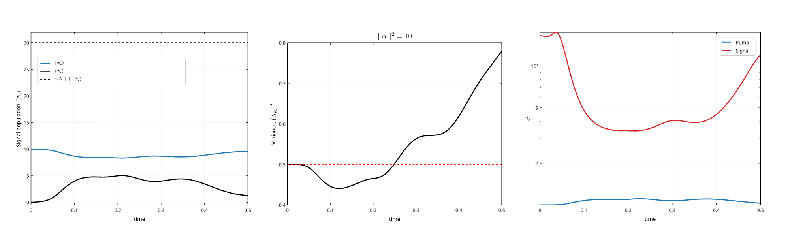

# third_harmonic

Photon population evolution for 3rd harmonic generation

Anecdotally, the computation time is reduced in half, at ~ 100s, vs the original code in python that served as model, taking ~ 200 s.

## Quick Start
```
> third_harmonic --help
Photon population evolution for 3rd harmonic generation

Usage: third_harmonic [OPTIONS]

Options:
  -v, --verbose                      Verbosity
  -a, --alpha-square <ALPHA_SQUARE>  Must be one of [10, 100, 1000, 2000] [default: 10]
  -h, --help                         Print help

> third_harmonic -a 10
StateEvolution::new(alpha_square=10) finished on 12 cores in 49.248699357s
Moments extraction and plot finished in 767.717829ms
```


## License

Licensed under either of

 * Apache License, Version 2.0
   ([LICENSE-APACHE](LICENSE-APACHE) or <http://www.apache.org/licenses/LICENSE-2.0>)
 * MIT license
   ([LICENSE-MIT](LICENSE-MIT) or <http://opensource.org/licenses/MIT>)

at your option.

## Contribution

Unless you explicitly state otherwise, any contribution intentionally submitted
for inclusion in the work by you, as defined in the Apache-2.0 license, shall be
dual licensed as above, without any additional terms or conditions.
